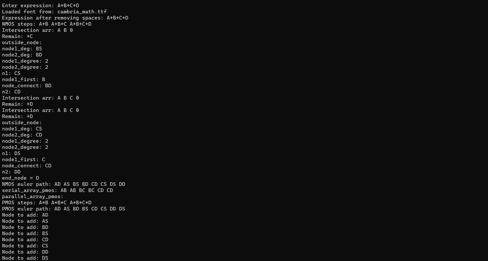
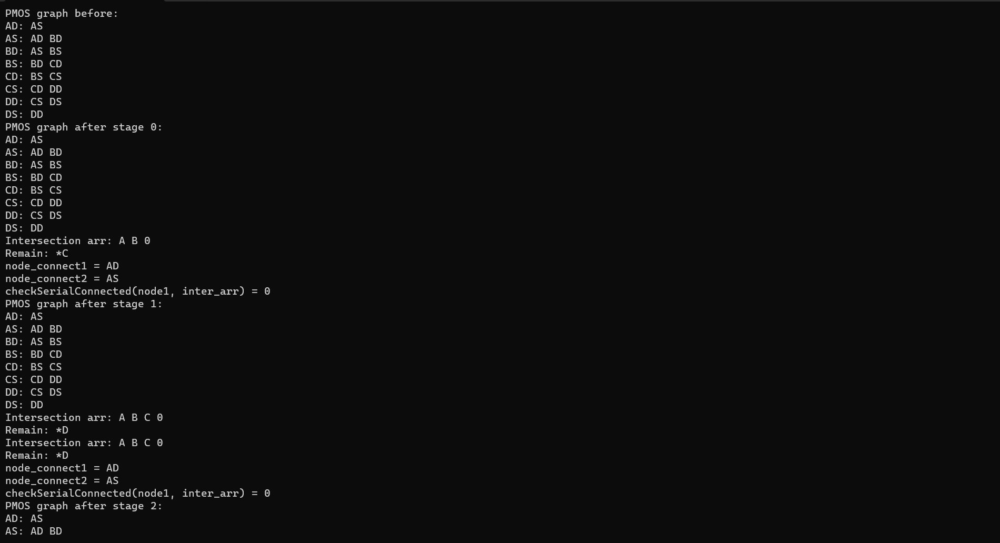
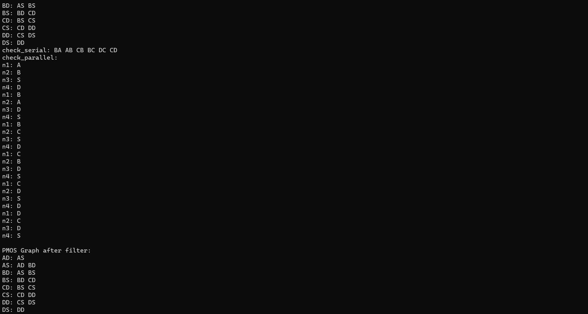
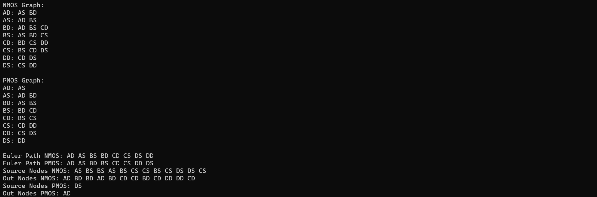
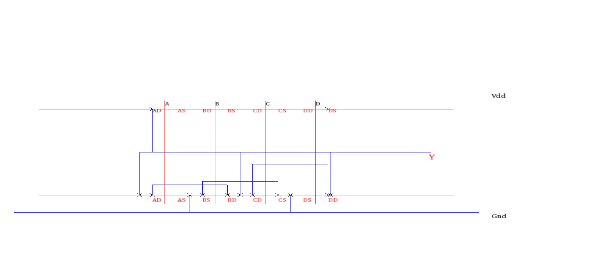

## 🧠 About the Project :
Developed a visual tool for generating CMOS stick diagrams from Boolean expressions.
The tool supports logic parsing, transistor network construction, and layout optimization using Euler path computation.
Built with the SFML library to render interactive, color-coded diagrams directly on screen.

🚀 Key Features :
• Logic Parsing :
Parses Boolean expressions consisting of logic components and operations to construct NMOS and PMOS transistor networks.

• Graph-Based Representation :
Models transistor connectivity using graph structures to represent cascaded and parallel configurations.
Utilizes Euler Path algorithms to optimize transistor layout for stick diagrams.

• SFML Visualization :
Renders color-coded CMOS stick diagrams — including VDD, GND, P-diff, and N-diff — using the SFML graphics library.
Layouts are dynamically generated based on parsed expressions and Euler paths.

• Error Handling :
Validates Boolean expressions and reports issues clearly through console error messages.

• Modular Design:  
Organizes code into independent modules:  
&nbsp;&nbsp;&nbsp;&nbsp;• expr: handles Boolean expression parsing and evaluation  
&nbsp;&nbsp;&nbsp;&nbsp;• graph: manages graph creation, connectivity, and Euler path computation

## 🧩 Project Components
• [`draw_stick_diagram.cpp`](https://github.com/NguyenHoanKhanh/StickDiagram/blob/main/draw_stick_diagram.cpp):  
&nbsp;&nbsp;&nbsp;&nbsp;Entry point of the application. Handles:

&nbsp;&nbsp;&nbsp;&nbsp;• User input.

&nbsp;&nbsp;&nbsp;&nbsp;• SFML window creation.

&nbsp;&nbsp;&nbsp;&nbsp;• Diagram rendering pipeline.

Integrates all core functionalities: expression handling, edge extraction, and stick diagram drawing.

• [`expression_euler_path.cpp`](https://github.com/NguyenHoanKhanh/StickDiagram/blob/main/expression_euler_path.cpp):
Implements the main logic for:

&nbsp;&nbsp;&nbsp;&nbsp;• Parsing Boolean expressions.

&nbsp;&nbsp;&nbsp;&nbsp;• Constructing NMOS/PMOS graphs.

&nbsp;&nbsp;&nbsp;&nbsp;• Computing Euler paths.

&nbsp;&nbsp;&nbsp;&nbsp;• Filtering PMOS edges for accurate diagram generation and optimization.

## 🧪 Results :

• This example is program process expression 4 variable : A+B+C+D

• Result will be display on screen : 

## ✅ Evaluation

